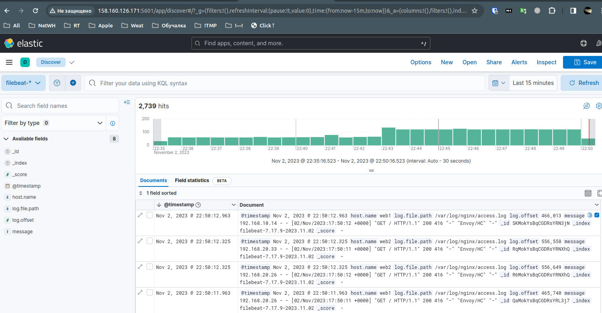
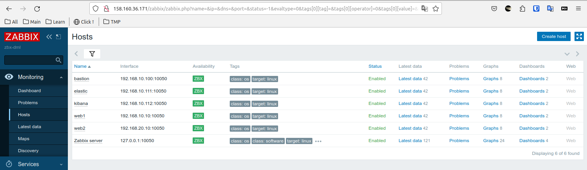
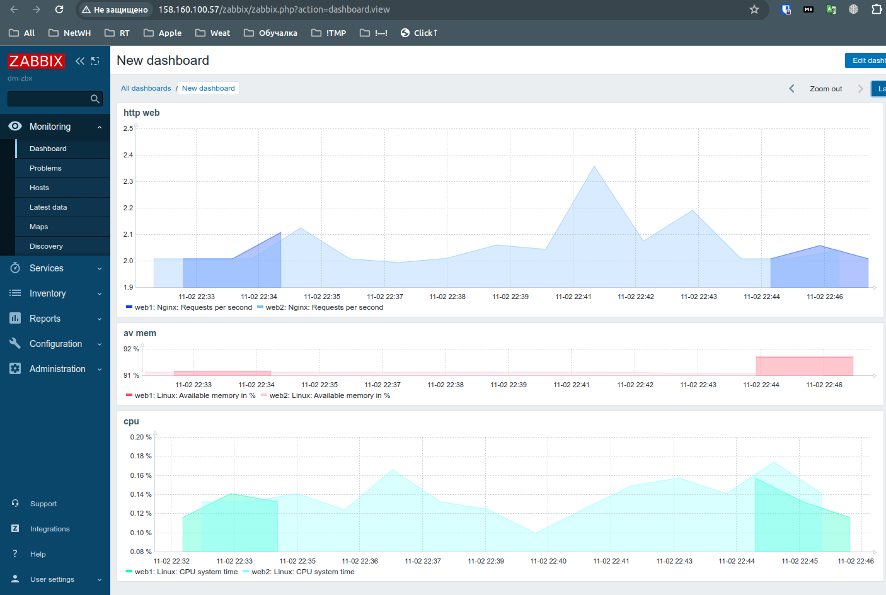

# Дипломная работа профессии Системный администратор - Лебедев Д.С.

В соответствии с заданием была разработана отказоустойчивая инфраструктура для сайта, включающая мониторинг, сбор логов и резервное копирование основных данных.

### Для создания инфраструктуры системы в Yandex Cloud (YC) используется ПО Terraform. Основные этапы:
- Создание виртуальных машин (ВМ) для http веб-серверов, идентичных, расположенных в разных зонах;
- Создание отказоустойчивой инфраструктуры для сайта, а именно: Target и Backend групп, http роутера, балансировщика нагрузки для веб-серверов;
- Настроена сеть, с подсетями в разных зонах, и с соответствующими группами безопасности для ВМ и сервисов;
- Созданы ВМ для организации систем мониторинга (Zabbix через zabbix-agent) и сбора лог-файлов с ВМ (Elasticsearch через Filebeat + сервер Kibana);
- Организовано резервное копирование данных, путём снятия snapshot дисков всех ВМ с определённой периодичностью.
### Для настройки созданных ВМ используется ПО Ansible. Основные этапы:
- Установка и первоначальная настройка http серверов;
- Установка и настройка сервера сбора логов Elasticsearch;
- Установка и настройка системы визуализации данных Kibana;
- Установка на соответствующих ВМ плагина для сбора и передачи логов Filebeat;
- Установка и первоначальная настройка сервера системы мониторинга Zabbix;
- Установка и настройка zabbix-agent для мониторинга ВМ инфраструктуры.

### 1. Terraform. Создание инфраструктуры.
1.1. Конфигурационный файл `main.tf` описывает провайдера и параметры подключения, ссылается на файл с описанием переменных `variables.tf` и использует файл переменных `terraform.tfvars`. Так же файлы `variables.tf`, `terraform.tfvars` и `locals.tf` используются для создания подсетей (subnet) с помощью цикла for_each.

<details>
<summary>main.tf</summary>

```bash
terraform {
  required_providers {
    yandex = {
      source = "yandex-cloud/yandex"
    }
  }
  required_version = ">= 0.13"
}


# Описание провайдера YC
provider "yandex" {
  service_account_key_file = "${file("~/authorized_key.json")}"
  cloud_id  = var.cloud_id
  folder_id = var.folder_id
  zone      = var.default_zone
}
```

</details>
<details>
<summary>variables.tf</summary>

```bash
#=========== main ==============

variable "cloud_id" {
  description = "The cloud ID"
  type        = string
}
variable "folder_id" {
  description = "The folder ID"
  type        = string
}
variable "default_zone" {
  description = "The default zone"
  type        = string
  default     = "ru-cenral1-a"
}


#=========== subnet ==============
variable "subnets" {
  description = "Subnets for www cluster"

  type = map(list(object(
    {
      name = string,
      zone = string,
      cidr = list(string)
    }))
  )
}

```
</details>
<details>
<summary>terraform.tfvars</summary>

```bash
#=========== main ==============
cloud_id  = "b1g31l9912a5snugc28a"
folder_id = "b1g5412cb8jjfmnc09pb"

#=========== subnet ==============
subnets = {
  "subnets" = [
    {
      name = "subnet-1"
      zone = "ru-central1-a"
      cidr = ["192.168.10.0/24"]
    },
    {
      name = "subnet-2"
      zone = "ru-central1-b"
      cidr = ["192.168.20.0/24"]
    },
    {
      name = "subnet-3"
      zone = "ru-central1-c"
      cidr = ["192.168.30.0/24"]
    }
  ]
}
```
</details>
<details>
<summary>locals.tf</summary>

```bash
locals {
  subnet_array = flatten([for k, v in var.subnets : [for j in v : {
    name = j.name
    zone = j.zone
    cidr = j.cidr
    }
  ]])
}
```
</details>

1.2. Конфигурационный файл `vms.tf` описывает создание ВМ, участвующих в проекте. В качестве операционной системы используется Linux Debian 11. ВМ веб-серверов размещены в разных зонах доступности. Инфраструктура состоит из следующих ВМ:
- web1, web2 - веб серверы, отдающие статическую страницу, идентичны. Не имеют внешнего IP - адреса;
- zabbix - ВМ для развертывания сервера мониторинга Zabbix, имеет внешний IP - адрес;
- elastic - ВМ для организации ELK - системы сбора логов, не имеет внешнего IP - адреса;
- kibana - ВМ веб-интерфейс для Elasticsearch, имеет внешний IP - адрес;
- bastion - ВМ для реализации концепции bastion host. Для организации SSH подключений ко всем ВМ, имеет внешний IP - адрес.

<details>
<summary>vms.tf</summary>

```bash
# === Bastion host ===
resource "yandex_compute_instance" "bastion" {
  name     = "bastion"
  hostname = "bastion"
  zone     = "ru-central1-a"
  

  scheduling_policy {
    preemptible = true
  }

  resources {
  # core_fraction = 20
    cores  = 2
    memory = 4
  }

  boot_disk {
    initialize_params {
      image_id = "fd87gocdmk3tosg6onpg"
      size     = 10
    }
  }

  network_interface {
    subnet_id          = yandex_vpc_subnet.subnet-main["subnet-1"].id
    security_group_ids = [yandex_vpc_security_group.sg-bastion.id]

    ip_address         = "192.168.10.100"
    nat                = true
  }

  metadata = {
    user-data = "${file("./meta.yaml")}"
  }
}


# === web servers ===

resource "yandex_compute_instance" "web1" {
  name     = "web1"
  hostname = "web1"
  zone     = "ru-central1-a"
  

  scheduling_policy {
    preemptible = true
  }

  resources {
    cores  = 2
    memory = 4
  }

  boot_disk {
    initialize_params {
      image_id = "fd87gocdmk3tosg6onpg"
      size     = 10
    }
  }

  network_interface {
    subnet_id          = yandex_vpc_subnet.subnet-main["subnet-1"].id
    security_group_ids = [yandex_vpc_security_group.sg-ssh.id, yandex_vpc_security_group.sg-webserv.id]
    ip_address         = "192.168.10.10"
    #nat                = false
  }

  metadata = {
    user-data = "${file("./meta.yaml")}"
  }
}


resource "yandex_compute_instance" "web2" {
  name     = "web2"
  hostname = "web2"
  zone     = "ru-central1-b"
  

  scheduling_policy {
    preemptible = true
  }

  resources {
    cores  = 2
    memory = 4
  }

  boot_disk {
    initialize_params {
      image_id = "fd87gocdmk3tosg6onpg"
      size     = 10
    }
  }

  network_interface {
    subnet_id          = yandex_vpc_subnet.subnet-main["subnet-2"].id
    security_group_ids = [yandex_vpc_security_group.sg-ssh.id, yandex_vpc_security_group.sg-webserv.id]
    ip_address         = "192.168.20.10"
  }

  metadata = {
    user-data = "${file("./meta.yaml")}"
  }
}


# === Zabbix ===
resource "yandex_compute_instance" "zabbix" {
  name = "zabbix"
  hostname = "zabbix"
  zone = "ru-central1-a"

  scheduling_policy {
    preemptible = true
  }

  resources {
    cores  = 4
    memory = 4
  }

  boot_disk {
    initialize_params {
      image_id = "fd87gocdmk3tosg6onpg"
      size = 10
    }
  }

  network_interface {
    subnet_id = yandex_vpc_subnet.subnet-main["subnet-1"].id
    nat       = true
    security_group_ids = [yandex_vpc_security_group.sg-ssh.id, yandex_vpc_security_group.sg-zabbix.id]
    ip_address         = "192.168.10.110"
  }

  metadata = {
    user-data = "${file("./meta.yaml")}"
  }
}


# === ElasticSearch ===
resource "yandex_compute_instance" "elastic" {

  name = "elastic"
  hostname = "elastic"
  zone = "ru-central1-a"

  scheduling_policy {
    preemptible = true
  }

  resources {
    cores  = 4
    memory = 8
  }

  boot_disk {
    initialize_params {
      image_id = "fd87gocdmk3tosg6onpg"
      size = 15
    }
  }

  network_interface {
    subnet_id = yandex_vpc_subnet.subnet-main["subnet-1"].id
    nat       = false
    security_group_ids = [yandex_vpc_security_group.sg-elastic.id, yandex_vpc_security_group.sg-ssh.id]
    ip_address         = "192.168.10.111"
  }

  metadata = {
    user-data = "${file("./meta.yaml")}"
  }
}


# === Kibana ===
resource "yandex_compute_instance" "kibana" {

  name = "kibana"
  hostname = "kibana"
  zone = "ru-central1-a"

  scheduling_policy {
    preemptible = true
  }

  resources {
    cores  = 4
    memory = 8
  }

  boot_disk {
    initialize_params {
      image_id = "fd87gocdmk3tosg6onpg"
      size = 15
    }
  }

  network_interface {
    subnet_id = yandex_vpc_subnet.subnet-main["subnet-1"].id
    nat       = true
    security_group_ids = [yandex_vpc_security_group.sg-kibana.id, yandex_vpc_security_group.sg-ssh.id]
    ip_address         = "192.168.10.112"
  }

  metadata = {
    user-data = "${file("./meta.yaml")}"
  }
}

```
</details>

1.3. Конфигурационный файл `network.tf` описывает создание сетевой инфраструктуры, а именно создание сети, подсетей, target и backeng групп, http - роутера, сервиса application load balancer для распределения трафика на веб-сервера. Так же в данном файле описывается создание Security Groups соответствующих сервисов.

<details>
<summary>network.tf</summary>

```bash
# === Сети и подсети ===

resource "yandex_vpc_network" "network-1" {
  name = "network1"
}

resource "yandex_vpc_subnet" "subnet-main" {
  for_each = {
    for k, v in local.subnet_array : "${v.name}" => v
  }
  network_id = yandex_vpc_network.network-1.id
  route_table_id = yandex_vpc_route_table.route-table.id

  v4_cidr_blocks = each.value.cidr
  zone           = each.value.zone
  name           = each.value.name
}


# === nat ===

resource "yandex_vpc_gateway" "nat-gw" {
  name = "nat-gw"
  shared_egress_gateway {}
}

resource "yandex_vpc_route_table" "route-table" {
  name       = "route-table"
  network_id = yandex_vpc_network.network-1.id

  static_route {
    destination_prefix = "0.0.0.0/0"
    gateway_id = yandex_vpc_gateway.nat-gw.id
  }
}


# === Target Group ===

resource "yandex_alb_target_group" "target-group" {
  name      = "target-group"

  target {
    subnet_id = "${yandex_vpc_subnet.subnet-main["subnet-1"].id}"
    ip_address   = "${yandex_compute_instance.web1.network_interface.0.ip_address}"
  }

  target {
    subnet_id = "${yandex_vpc_subnet.subnet-main["subnet-2"].id}"
    ip_address   = "${yandex_compute_instance.web2.network_interface.0.ip_address}"
  }
}


# === Backend Group ===

resource "yandex_alb_backend_group" "backend-group" {
  name      = "backend-group"

  http_backend {
    name = "backend-group"
    weight = 1
    port = 80
    target_group_ids = ["${yandex_alb_target_group.target-group.id}"]
    healthcheck {
      timeout = "10s"
      interval = "2s"
      healthy_threshold = 10
      unhealthy_threshold = 15
      http_healthcheck {
        path  = "/"
      }
    }
  }
}

# === HTTP Router ===

resource "yandex_alb_http_router" "http-router" {
  name      = "http-router"
}

resource "yandex_alb_virtual_host" "virtual-host" {
  name      = "virtual-host"
  http_router_id = yandex_alb_http_router.http-router.id
  route {
    name = "route"

    http_route {
      http_route_action {
        backend_group_id = yandex_alb_backend_group.backend-group.id
        timeout = "60s"
      }
    }
  }
}

# === Application Load Balancer ===

resource "yandex_alb_load_balancer" "load-balancer" {
  name        = "load-balancer"

  network_id  = yandex_vpc_network.network-1.id
  security_group_ids = [yandex_vpc_security_group.security-public-alb.id]

  allocation_policy {
    location {
      zone_id   = "ru-central1-a"
      subnet_id = yandex_vpc_subnet.subnet-main["subnet-1"].id
    }

    location {
      zone_id   = "ru-central1-b"
      subnet_id = yandex_vpc_subnet.subnet-main["subnet-2"].id
    }
  }

  listener {
    name = "listener"
    endpoint {
      address {
        external_ipv4_address {
        }
      }
      ports = [ 80 ]
    }
    http {
      handler {
        http_router_id = yandex_alb_http_router.http-router.id
      }
    }
  }
}


# === Security groups ===

# --- Bastion ---

resource "yandex_vpc_security_group" "sg-bastion" {
  name        = "sg-bastion"
  network_id  = yandex_vpc_network.network-1.id
  ingress {
    protocol       = "TCP"
    port           = 22
    v4_cidr_blocks = ["0.0.0.0/0"]
  }

  ingress {
    protocol       = "TCP"
    description    = "Вход от zabbix"
    port           = 10050
    v4_cidr_blocks = ["192.168.10.0/24", "192.168.20.0/24", "192.168.30.0/24"]  
  }

  egress {
    protocol       = "ANY"
    v4_cidr_blocks = ["0.0.0.0/0"]
    from_port      = 0
    to_port        = 65535
  }
}


# --- ssh traffic ---

resource "yandex_vpc_security_group" "sg-ssh" {
  name        = "sg-ssh"
  network_id  = yandex_vpc_network.network-1.id
  ingress {
    protocol       = "TCP"
    port           = 22
    v4_cidr_blocks = ["192.168.10.0/24", "192.168.20.0/24", "192.168.30.0/24"]
  }

  ingress {
    protocol       = "ICMP"
    v4_cidr_blocks = ["192.168.10.0/24", "192.168.20.0/24", "192.168.30.0/24"]
  }
}


# --- Load Balancer ---

resource "yandex_vpc_security_group" "security-public-alb" {
  name        = "security-public-alb"
  network_id  = yandex_vpc_network.network-1.id

  ingress {
    protocol       = "TCP"
    v4_cidr_blocks = ["0.0.0.0/0"]
  }

  egress {
    protocol       = "ANY"
    v4_cidr_blocks = ["0.0.0.0/0"]
    from_port      = 0
    to_port        = 65535
  }
}


# --- webservers ---

resource "yandex_vpc_security_group" "sg-webserv" {
  name           = "sg-webserv"
  network_id     = yandex_vpc_network.network-1.id
  
  ingress {
    protocol       = "TCP"
    description    = "Вход для http"
    port           = 80
    v4_cidr_blocks = ["192.168.10.0/24", "192.168.20.0/24", "192.168.30.0/24"]
  }

  ingress {
    protocol       = "TCP"
    description    = "Вход от zabbix"
    port           = 10050
    v4_cidr_blocks = ["192.168.10.0/24", "192.168.20.0/24", "192.168.30.0/24"]  
  }

  egress {
    protocol       = "ANY"
    description    = "Исходящие не ограничиваем"
    v4_cidr_blocks = ["0.0.0.0/0"]
    from_port      = 0
    to_port        = 65535
  }
}


# --- Zabbix ---

resource "yandex_vpc_security_group" "sg-zabbix" {
  name       = "sg-zabbix"
  network_id = yandex_vpc_network.network-1.id

  ingress {
    protocol       = "TCP"
    description    = "Вход веб-интерфейса"
    port           = 80
    v4_cidr_blocks = ["0.0.0.0/0"]
  }

  ingress {
    protocol       = "TCP"
    description    = "Входящий от zabbix-agent'ов"
    port           = 10051
    v4_cidr_blocks = ["192.168.10.0/24", "192.168.20.0/24", "192.168.30.0/24"]
  }

  egress {
    protocol       = "ANY"
    v4_cidr_blocks = ["0.0.0.0/0"]
    from_port      = 0
    to_port        = 65535
  }
}


# --- ElasticSearch ---

resource "yandex_vpc_security_group" "sg-elastic" {
  name        = "sg-elastic"
  network_id  = yandex_vpc_network.network-1.id

  ingress {
    protocol       = "TCP"
    description    = "Входящий для elastic"
    port           = 9200
    v4_cidr_blocks = ["192.168.10.0/24", "192.168.20.0/24", "192.168.30.0/24"]
  }

  ingress {
    protocol       = "TCP"
    description    = "Вход от zabbix"
    port           = 10050
    v4_cidr_blocks = ["192.168.10.0/24", "192.168.20.0/24", "192.168.30.0/24"]  
  }

  egress {
    protocol       = "ANY"
    v4_cidr_blocks = ["0.0.0.0/0"]
    from_port      = 0
    to_port        = 65535
  }
}


# --- Kibana ---

resource "yandex_vpc_security_group" "sg-kibana" {
  name        = "sg-kibana"
  network_id  = yandex_vpc_network.network-1.id

  ingress {
    protocol       = "TCP"
    description    = "Входящий для веб-интерфейса"
    port           = 5601
    v4_cidr_blocks = ["0.0.0.0/0"]
  }

  ingress {
    protocol       = "TCP"
    description    = "Вход от zabbix"
    port           = 10050
    v4_cidr_blocks = ["192.168.10.0/24", "192.168.20.0/24", "192.168.30.0/24"]  
  }

  egress {
    protocol       = "ANY"
    v4_cidr_blocks = ["0.0.0.0/0"]
    from_port      = 0
    to_port        = 65535
  }
}
```
</details>

1.4. Файл `output.tf` служит для вывода информации о IP адресации создаваемых ВМ и сервисов, а так же для формирования в дальнейшем файла с параметрами для SSH подключения к ВМ через специально выделенную машину.

<details>
<summary>output.tf</summary>

```bash
output "output-ip-host" {
  value = <<OUTPUT

App load balancer
external = ${yandex_alb_load_balancer.load-balancer.listener.0.endpoint.0.address.0.external_ipv4_address.0.address}

VM bastion
internal = ${yandex_compute_instance.bastion.fqdn}
external = ${yandex_compute_instance.bastion.network_interface.0.nat_ip_address}

VM web1
internal = ${yandex_compute_instance.web1.fqdn}

VM web2
internal = ${yandex_compute_instance.web2.fqdn}

VM Elastic
internal = ${yandex_compute_instance.elastic.fqdn}

VM Kibana
internal = ${yandex_compute_instance.kibana.fqdn}
external = ${yandex_compute_instance.kibana.network_interface.0.nat_ip_address}

VM Zabbix
internal = ${yandex_compute_instance.zabbix.fqdn}
external = ${yandex_compute_instance.zabbix.network_interface.0.nat_ip_address}

OUTPUT
}

output "output-ansible-hosts" {
  value = <<OUTPUT

[bastion]
bastion-host ansible_host=${yandex_compute_instance.bastion.network_interface.0.nat_ip_address} ansible_ssh_user=dml

[webservers]
web1 ansible_host=${yandex_compute_instance.web1.fqdn}
web2 ansible_host=${yandex_compute_instance.web2.fqdn}

[elastic]
elastic-host ansible_host=${yandex_compute_instance.elastic.fqdn}

[kibana]
kibana-host ansible_host=${yandex_compute_instance.kibana.fqdn}

[zabbix]
zabbix-host ansible_host=${yandex_compute_instance.zabbix.fqdn}

[webservers:vars]
ansible_ssh_user=dml
ansible_ssh_common_args='-o ProxyCommand="ssh -W %h:%p dml@${yandex_compute_instance.bastion.network_interface.0.nat_ip_address}"'

[elastic:vars]
ansible_ssh_user=dml
ansible_ssh_common_args='-o ProxyCommand="ssh -W %h:%p dml@${yandex_compute_instance.bastion.network_interface.0.nat_ip_address}"'

[kibana:vars]
ansible_ssh_user=dml
ansible_ssh_common_args='-o ProxyCommand="ssh -W %h:%p dml@${yandex_compute_instance.bastion.network_interface.0.nat_ip_address}"'

[zabbix:vars]
ansible_ssh_user=dml
ansible_ssh_common_args='-o ProxyCommand="ssh -W %h:%p dml@${yandex_compute_instance.bastion.network_interface.0.nat_ip_address}"'

OUTPUT
}
```
</details>

1.5. С помощью файла `snapshot.tf` организована система резервного копирования дисков всех ВМ. 

<details>
<summary>snapshot.tf</summary>

```bash
resource "yandex_compute_snapshot_schedule" "snapshot" {
  name = "snapshot"

  schedule_policy {
    expression = "0 15 ? * *"
  }

  retention_period = "24h"
  snapshot_count = 7

  snapshot_spec {
    description = "daily-snapshot"
  }

  disk_ids = ["${yandex_compute_instance.bastion.boot_disk.0.disk_id}",
    "${yandex_compute_instance.web1.boot_disk.0.disk_id}",
    "${yandex_compute_instance.web2.boot_disk.0.disk_id}",
    "${yandex_compute_instance.zabbix.boot_disk.0.disk_id}",
    "${yandex_compute_instance.elastic.boot_disk.0.disk_id}",
    "${yandex_compute_instance.kibana.boot_disk.0.disk_id}"]
}
```
</details>

---
После валидации и отладки, успешного запуска terraform, в YC успешно развернута требуемая для проекта инфраструктура.


Резервное копироваение:  


1.6. Для перехода к следующему этапу (настройке инфраструктуры), на основе результатов работы конфигурационного файла output.tf в каталоге с плейбуками ansible создается файл hosts. В данном файле описываются адреса и параметры подключения для работы ПО Ansible по SSH через выделенную ВМ bastion.

Подготовка файла инвентаризации  
```bash
terraform output output-ansible-hosts > ./ansible/hosts
cd ./ansible
sed -i '1d; $d' hosts
```

Пример созданного файла инвентаризации  
<details>
<summary>hosts</summary>

```bash
[bastion]
bastion-host ansible_host=84.201.173.142 ansible_ssh_user=dml

[webservers]
web1 ansible_host=web1.ru-central1.internal
web2 ansible_host=web2.ru-central1.internal

[elastic]
elastic-host ansible_host=elastic.ru-central1.internal

[kibana]
kibana-host ansible_host=kibana.ru-central1.internal

[zabbix]
zabbix-host ansible_host=zabbix.ru-central1.internal

[webservers:vars]
ansible_ssh_user=dml
ansible_ssh_common_args='-o ProxyCommand="ssh -W %h:%p dml@84.201.173.142"'

[elastic:vars]
ansible_ssh_user=dml
ansible_ssh_common_args='-o ProxyCommand="ssh -W %h:%p dml@84.201.173.142"'

[kibana:vars]
ansible_ssh_user=dml
ansible_ssh_common_args='-o ProxyCommand="ssh -W %h:%p dml@84.201.173.142"'

[zabbix:vars]
ansible_ssh_user=dml
ansible_ssh_common_args='-o ProxyCommand="ssh -W %h:%p dml@84.201.173.142"'
```
</details>

---
### 2. Ansible. Настройка инфраструктуры.

Настройка начинается с проверки доступности всех хостов через ВМ bastion  


2.1. Настройка Веб - серверов осуществляется запуском скрипта `01-webserv-playbook.yml`. Итог работы - на двух ВМ развернуты и запущены HTTP-серверы Nginx, передан первоначальный набор файлов для сайта, заменён конфигурационный файл nginx.conf

  

  

  

2.2. Скрипт `02-elastic-playbook.yml` разворачивает сервер elasticsearch. Так как этот сервис работает в Docker - контейнере, устанавливается docker и необходимые для него пакеты.
Результат работы:  
  

2.3. Скрипт `03-kibana-playbook.yml` разворачивает контейнер Docker c Kibana (веб-интерфейс для Elasticsearch). Устанавливается docker и неоходимые для него пакеты.
Результат работы:  
  

2.4. Скрипт `04-filebeat-playbook.yml` инсталлирует, настраивает и запускает ПО filebeat на ВМ с веб - серверами. Конфигурация настроена на отправку access.log, error.log nginx в Elasticsearch. Стабильно работающий deb пакет `filebeat-7.17.9-amd64.deb` заливается на веб - серверы с машины Ansible.
Результат работы скрипта:  
  

Вход в веб - интерфейс Kibana:  
  

2.5. Скрипт `05-zabbix_server-playbook.yml` разворачивает на ВМ сервер мониторинга Zabbix и необходимое для его работы ПО, начально конфигурирует базу данных, правит конфиг zabbix_server.conf.
Результат работы скрипта:  
  

2.6. Скрипт `06-zabbix_agent-playbook.yml` устанавливает на все ВМ ПО Zabbix-agent для работы с сервером Zabbix, правит конфиг zabbix_agentd.conf.
Результат работы скрипта:  
  

В результате, после установки необходимого ПО мониторинга, можно приступать к настройке отображения нужной информации в веб - интерфейсе сервера Zabbix:  

  

  

  

  

Настройка мониторинга веб - сайтов  
